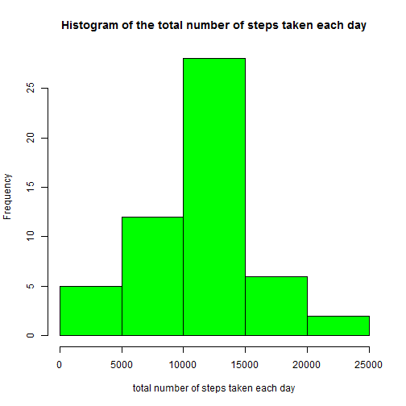
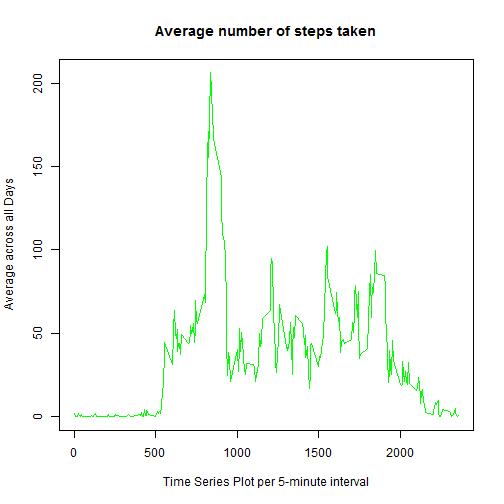
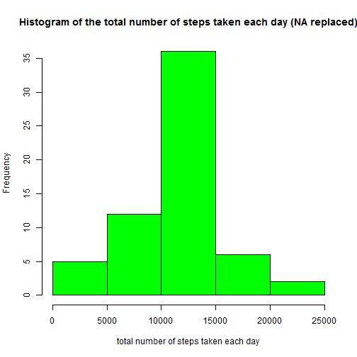
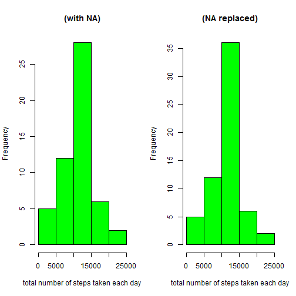
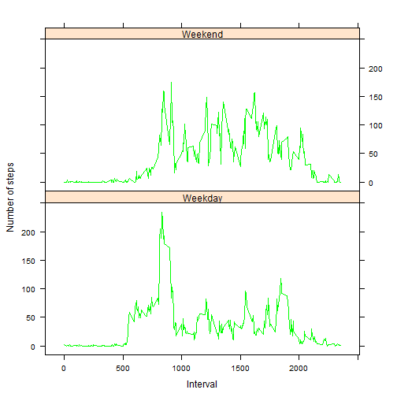

# Reproducible Research: Peer Assessment 1
This assignment makes use of data from a personal activity monitoring device. 
This device collects data at 5 minute intervals through out the day. 
The data consists of two months of data from an anonymous individual collected during 
the months of October and November, 2012 and include the number of steps taken in 
5 minute intervals each day.
Data source : https://d396qusza40orc.cloudfront.net/repdata%2Fdata%2Factivity.zip

## Loading and preprocessing the data

```r
if (!file.exists("activity.csv")) {
    unzip("activity.zip")
}
activity <- read.csv("activity.csv", colClasses = c("numeric", "character", 
    "numeric"))
activity$date <- as.Date(activity$date, "%Y-%m-%d")
totalSteps <- aggregate(steps ~ date, data = activity, sum, na.rm = TRUE)

hist(totalSteps$steps, main = "Histogram of the total number of steps taken each day", xlab = "total number of steps taken each day", col = "green")
```

 


## What is mean total number of steps taken per day?

```r
  mean(totalSteps$steps)
```

```
## [1] 10766
```

```r
  median(totalSteps$steps)
```

```
## [1] 10765
```


## What is the average daily activity pattern?

```r
time_series <- tapply(activity$steps, activity$interval, mean, na.rm = TRUE)
```
The plot is:

```r
plot(row.names(time_series), time_series, type = "l", xlab = "Time Series Plot per 5-minute interval", 
    ylab = "Average across all Days", main = "Average number of steps taken", 
    col = "green")
```

 

Following contains the maximum number of steps for 5-minute interval, on average across all the days in the dataset


```r
max_interval <- which.max(time_series)
names(max_interval)
```

```
## [1] "835"
```

## Imputing missing values
Total number of missing values in the dataset (i.e. the total number of rows with NAs)

```r
activity_NA <- sum(is.na(activity))
activity_NA
```

```
## [1] 2304
```
### Replacing missing values with average of steps per interval

```r
meanInterval <- aggregate(activity$steps, by = list(activity$interval), mean, na.rm = TRUE, 
    na.action = NULL)
names(meanInterval)[1] <- "interval"
names(meanInterval)[2] <- "mean.steps"
naRepacedData <- merge(activity, meanInterval, by = "interval", sort = FALSE)  
naRepacedData <- naRepacedData[with(naRepacedData, order(date, interval)), ]  
naRepacedData$steps[is.na(naRepacedData$steps)] <- naRepacedData$mean.steps[is.na(naRepacedData$steps)]
nAReplacedData <- naRepacedData[, c(2, 3, 1)]
```
plot

```r
activityDataWithNAReplaced <- aggregate(nAReplacedData$steps, by = list(nAReplacedData$date), sum)
names(activityDataWithNAReplaced)[1] <- "day"
names(activityDataWithNAReplaced)[2] <- "steps"
hist(activityDataWithNAReplaced$steps, main = "Histogram of the total number of steps taken each day (NA replaced)"
     , xlab = "total number of steps taken each day", col = "green")
```

 

Get mean


```r
mean(activityDataWithNAReplaced$steps, na.rm = TRUE)
```

```
## [1] 10766
```
Get median


```r
median(activityDataWithNAReplaced$steps, na.rm = TRUE)
```

```
## [1] 10766
```


The histogram shows overall higher frequencies due to the NA being replaced in the new histogram. 

```r
activityWithNa <- aggregate(activity$steps, by = list(activity$date), sum)
names(activityWithNa)[1] <- "day"
names(activityWithNa)[2] <- "steps"
par(mfrow = c(1, 2))

hist(activityWithNa$steps, main = "(with NA)", xlab = "total number of steps taken each day",col = "green")

hist(activityDataWithNAReplaced$steps, main = "(NA replaced)", 
     xlab = "total number of steps taken each day",col = "green")
```

 

## Are there differences in activity patterns between weekdays and weekends?

```r
day <- weekdays(activity$date)
daylevel <- vector()
for (i in 1:nrow(activity)) {
    if (day[i] == "Saturday") {
        daylevel[i] <- "Weekend"
    } else if (day[i] == "Sunday") {
        daylevel[i] <- "Weekend"
    } else {
        daylevel[i] <- "Weekday"
    }
}
activity$daylevel <- daylevel
activity$daylevel <- factor(activity$daylevel)

stepsByDay <- aggregate(steps ~ interval + daylevel, data = activity, mean)
names(stepsByDay) <- c("interval", "daylevel", "steps")
```
Here is  plot containing a time series plot �) of the 5-minute interval (x-axis) 
and the average number of steps taken, averaged across all weekday days or weekend days (y-axis). 


```r
library(lattice)
xyplot(steps ~ interval | daylevel, stepsByDay, type = "l", layout = c(1, 2), 
    xlab = "Interval", ylab = "Number of steps",col = "green")
```

 

